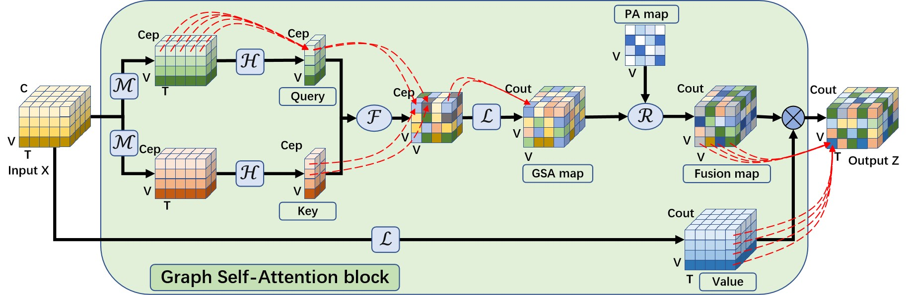
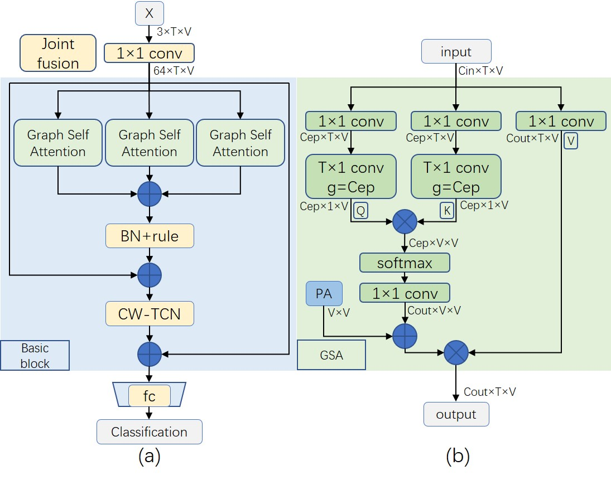

# MGSAN
Note: We provide our MGSAN test weight achieving 85.5% on NTU120 CSub with joint modality only, and six-stream MGSAN achieving 90.3% on NTU120 CSub.

## Architecture of GSA


## Structure of MGSAN

# Prerequisites
- Python >= 3.6
- PyTorch >= 1.1.0
- PyYAML, tqdm, tensorboardX

- We provide the dependency file of our experimental environment, you can install all dependencies by creating a new anaconda virtual environment and running `pip install -r requirements.txt `
- Run `pip install -e torchlight`

#### NTU RGB+D 60 and 120

1. Request NTU RGB+D 120 Skeleton dataset here: https://rose1.ntu.edu.sg/dataset/actionRecognition
2. Download the skeleton-only datasets:
   1. `nturgbd_skeletons_s001_to_s017.zip` (NTU RGB+D 60)
   2. `nturgbd_skeletons_s018_to_s032.zip` (NTU RGB+D 120)
   3. Extract above files to `./data/nturgbd_raw`


### Data Processing
- To replicate the accuracy of the model, you need to install the dataset to the specified location and run the next Data Processing.

#### Directory Structure
- Put downloaded data into the following directory structure:

```
- data/
  - ntu/
  - ntu120/
  - nturgbd_raw/
    - nturgb+d_skeletons/     # from `nturgbd_skeletons_s001_to_s017.zip`
      ...
    - nturgb+d_skeletons120/  # from `nturgbd_skeletons_s018_to_s032.zip`
      ...
```

#### Generating Data

- Generate NTU RGB+D 60 or NTU RGB+D 120 dataset:

```
 cd ./data/ntu # or cd ./data/ntu120
 # Get skeleton of each performer
 python get_raw_skes_data.py
 # Remove the bad skeleton 
 python get_raw_denoised_data.py
 # Transform the skeleton to the center of the first frame
 python seq_transformation.py
```

# Training & Testing

### Training

- Change the config file depending on what you want.

```
# Example: training MGSAN on NTU RGB+D 120 cross subject with GPU 0
python main.py --config config/nturgbd120-cross-subject/default.yaml --work-dir work_dir/ntu120/csub/mgsan --device 0
# Example: training provided Simple_GCN on NTU RGB+D 120 cross subject
python main.py --config config/nturgbd120-cross-subject/default.yaml --model model.Simple_GCN.Model--work-dir work_dir/ntu120/csub/Simple_GCN --device 0
```


### Testing

- To test the trained models saved in ./test_weights/test/NTU120_csub_joint, run the following command, 
and you will get MGSAN test weight achieving 85.5% on NTU120 CSub with joint modality only.
```
python main.py --phase test --weights ./test_weights/test/NTU120_csub_joint/runs-94-46248.pt --device 0
```

- To ensemble the results of different modalities, run the following command, and you will get the multi-stream fusion accuracy of MGSAN on NTU120 CSub, 
where 2-stream accuracy is 89.1, 4-stream accuracy is 90, and 6-stream accuracy is 90.3.
```
# Example: ensemble six modalitiese of MGSAN on NTU RGB+D 120 cross subjct
python Mensemble.py --dataset ntu120/xsub --joint-dir ./test_weights/ensemble/NTU120_csub_joint --bone-dir ./test_weights/ensemble/NTU120_csub_bone --joint2-dir ./test_weights/ensemble/NTU120_csub_joint2 --bone2-dir ./test_weights/ensemble/NTU120_csub_bone2 --joint3-dir ./test_weights/ensemble/NTU120_csub_joint3 --bone3-dir ./test_weights/ensemble/NTU120_csub_bone3
```

